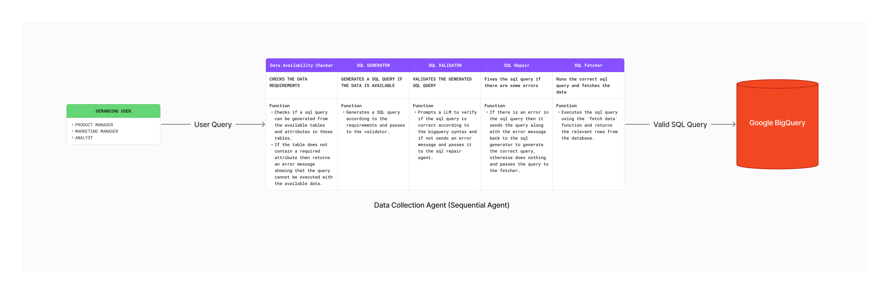

# ADK-Hackathon: EchoQL Data Collection Agent

A modular, agentic system for natural language data querying and analytics, designed for the Google ADK Hackathon. This project enables non-technical users (e.g., Product Managers, Marketing Managers, Analysts) to query data using natural language, which is then translated into validated SQL and executed on Google BigQuery.

---

## 🧠 Agentic Workflow

 <!-- Update with actual path if you want to embed -->

**Workflow Steps:**
1. **User Query:** A demanding user submits a natural language question.
2. **Data Availability Checker:** Checks if the query can be answered with the available tables and fields.
3. **SQL Generator:** Generates a SQL query if the data is available.
4. **SQL Validator:** Validates the generated SQL for syntax and BigQuery compatibility.
5. **SQL Repair:** If invalid, repairs the SQL and re-validates.
6. **SQL Fetcher:** Executes the validated SQL and fetches the data from BigQuery.
7. **Result:** Returns the result to the user.

---

## 📁 Project Structure

```
ADK-Hackathon/
│
├── src/
│   └── agents/
│       └── EchoQL_Agent/
│           ├── agent.py                # Orchestrates the agent workflow
│           ├── requirements.txt        # Python dependencies
│           └── subagents/
│               ├── data_availability_checker_agent/
│               │   └── agent.py        # Checks if query is answerable
│               ├── sql_generator_agent/
│               │   └── agent.py        # Generates SQL from NL query
│               ├── sql_validator_agent/
│               │   └── agent.py        # Validates SQL syntax/dialect
│               ├── sql_repair_agent/
│               │   └── agent.py        # Repairs invalid SQL
│               └── sql_fetcher_agent/
│                   ├── agent.py        # Executes SQL, fetches data
│                   └── bigquery_connector.py # BigQuery connection logic
│
├── deployment/
│   └── deploy_agent.py                 # Deployment script for Vertex AI
├── configs/                            # Mock schema and data descriptions
├── Mock_Data/                          # Example CSVs for local testing
├── scripts/                            # Utility scripts
├── notebooks/                          # Data generation notebooks
├── pyproject.toml                      # Poetry project config
├── README.md                           # This file
└── makefile                            # Build and automation commands
```

---

## 🏗️ Agents Overview

- **Data Availability Checker:**  
  Checks if the user's query can be answered with the available schema. Returns a JSON indicating availability and the schema used.

- **SQL Generator:**  
  Converts the user's request and schema context into a BigQuery SQL query. Returns raw SQL only.

- **SQL Validator:**  
  Validates the SQL for syntax, structure, and BigQuery dialect. Returns `valid` or `invalid: <reason>`.

- **SQL Repair:**  
  If the SQL is invalid, regenerates a correct query using the original request, invalid SQL, and error message. Re-validates the new SQL.

- **SQL Fetcher:**  
  Executes the validated SQL using BigQuery, stores the result as a DataFrame, and prints the result to the chat.

---

## 🚀 Getting Started

### 1. **Clone the Repository**
```bash
git clone https://github.com/your-org/ADK-Hackathon.git
cd ADK-Hackathon
```

### 2. **Install Dependencies**
We recommend using [Poetry](https://python-poetry.org/) for dependency management:
```bash
poetry install
```
Or, use pip with the provided requirements:
```bash
pip install -r src/agents/EchoQL_Agent/requirements.txt
```

### 3. **Set Up Environment Variables**
Copy or create a `.env` file in the project root with your Google Cloud and model settings. Example:
```
GOOGLE_GENAI_USE_VERTEXAI=TRUE
GOOGLE_CLOUD_PROJECT=your-gcp-project
GOOGLE_CLOUD_LOCATION=your-region
...
```

### 4. **Run Locally**
You can run the agents or scripts directly for local development and testing.

### 5. **Deploy to Google Cloud**
Use the `Makefile`:
```bash
make deploy
```

This will deploy the agent to Google Cloud.

---

## 🧩 Configuration

- **Schema & Mock Data:**  
  Located in `configs/` and `Mock_Data/` for local testing and development.

- **Agent Orchestration:**  
  The main agent (`src/agents/EchoQL_Agent/agent.py`) uses a `SequentialAgent` to chain the subagents in the correct order.

---

## 📝 Example Usage

- **User Query:**  
  "Show me the number of active users in the last month."

- **Agentic Flow:**  
  1. Data Availability Checker: Confirms if the required data exists.
  2. SQL Generator: Produces a SQL query for BigQuery.
  3. SQL Validator: Checks the query.
  4. SQL Repair: Fixes if needed.
  5. SQL Fetcher: Runs the query and returns results.

---

## 📦 Dependencies

See [`src/agents/EchoQL_Agent/requirements.txt`](src/agents/EchoQL_Agent/requirements.txt) for the full list. Key packages:
- `google-adk`
- `google-cloud-bigquery[pandas]`
- `google-genai`
- `fastapi`
- `pandas`
- `python-dotenv`
- and more...

---

## 🛡️ License

Licensed under the Apache License 2.0.

---

## 👥 Authors

- Raj Vasani (<rajvasani.de@gmail.com>)
- Tejash Varsani (<tejashvarsani123@gmail.com>)

---

## 🤖 Acknowledgements

- Built for the Google ADK Hackathon on Devpost.
- Uses Google Vertex AI, BigQuery, and the ADK agent framework.

---

*For more details, see the code and comments in each agent's `agent.py` file.*
